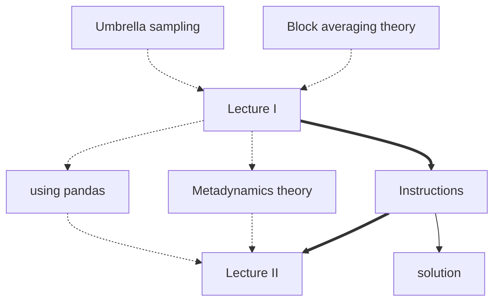

```mermaid
flowchart TB;
  A[Umbrella sampling] -.-> C[Lecture I] 
  B[Block averaging theory] -.-> C
  C -.-> H[Metadynamics theory];
  C ==> D[Instructions];
  C -.-> G[using pandas];
  G -.-> E;
  H -.-> E;
  D ==> E[Lecture II];
  D --> F[solution];
  click A "ref1" "This lesson teaches you how to run umbrella sampling calculations. You will need to follow the instructions on installing gromacs and plumed within it to run your metadynamics simulation. However, you do not need to perform the exercises on umbrella sampling in order to perfom these exercises on metadynamics";
  click B "ref2" "This lesson introduces you to more of the theory of block averaging.  You use this method here to calculate the error bars on the averages that you obtain from your metadynamics simulations";
  click C "video1" "A lecture that was given on March 1st 2021 as part of the plumed masterclass series that introduces you to the exercises in this lesson";
  click D "INSTRUCTIONS.md" "The instructions for the exercises";
  click E "video2" "A lecture that was given on March 8th 2021 as part of the plumed masterclass series that goes through the solutions to the exercises in the lesson";
  click F "notebooks/solution.ipynb" "A python notebook that contains a full set of solutions to the exercises that are discussed in the masterclass.  This notebook is the one that was editted during the section video lecture of the masterclass";
  click G "notebooks/plumed-pandas.ipynb" "A python notebook file that illustrates how you can use pandas to read in COLVAR files that are generated with PLUMED";
  click H "THEORY.md" "A (very) brief introduction to the theory of metadynamics.  If you are interested in learning more about metadyanmics we would strongly encourage you to read one of the many reviews on this topic.  There are links to suitable reviews in the exercises.";
```
