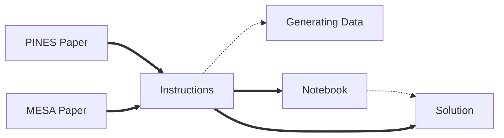

```mermaid
flowchart LR;
  A[PINES Paper] ==> C[Instructions] 
  B[MESA Paper] ==> C
  C -.-> E[Generating Data];
  C ==> D[Notebook];
  D -.-> F;
  C ==> F[Solution];
  click A "ref1" "The paper about the PINES method introduced in this tutorial";
  click B "ref2" "The paper about the MESA method, the previous iteration of PINES which is not permutation invariant";
  click C "INSTRUCTIONS.md" "A very brief introduction to PINES and the instructions for the exercises";
  click E "data/" "Generating data for the tutorial";
  click D "notebooks/exercise.ipynb" "A python notebook file containing the exercise";
  click F "notebooks/solution.ipynb" "A python notebook that contains solutions to the exercises";
```
